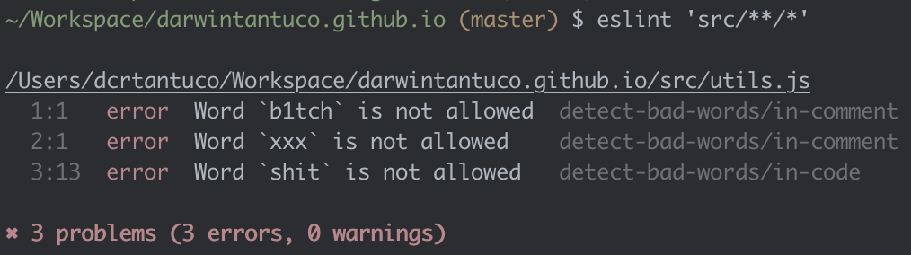

# eslint-plugin-detect-bad-words


Detect bad/profanity words in code

Uses [badwords](https://github.com/MauriceButler/badwords) under the hood



## Installation

You'll first need to install [ESLint](http://eslint.org):

Next, install `eslint-plugin-detect-bad-words`:

### npm

```
$ npm install eslint-plugin-detect-bad-words --save-dev
```

### yarn

```
$ yarn add eslint-plugin-detect-bad-words --dev
```

## Usage

Add `detect-bad-words` to the plugins section of your `.eslintrc` configuration file. You can omit the `eslint-plugin-` prefix:

```json
{
  "plugins": ["detect-bad-words"]
}
```

Then configure the rules you want to use under the rules section.

```json
{
  "rules": {
    "detect-bad-words/in-code": "error",
    "detect-bad-words/in-comment": "error"
  }
}
```

### Optional

You can define custom bad words under settings section.

```json
{
  "settings": {
    "customBadWords": ["wtf", "fck", "sht"]
  }
}
```

## License

MIT
